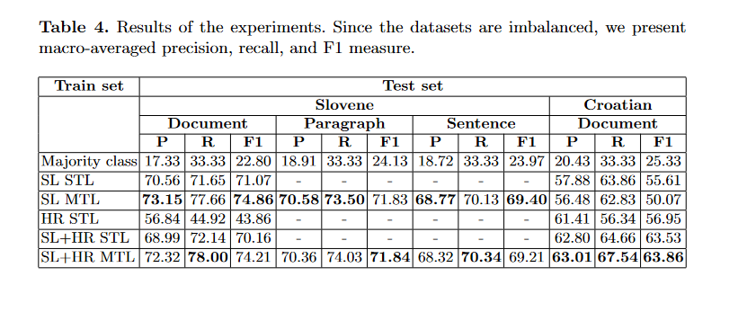

# Sentiment Analyser SL-HR News
Repository for the paper **Multi-task Learning for Cross-Lingual SentimentAnalysis**

### Data
- Sentiment Annotated Dataset of Croatian News Corpus.  Kindly refer https://www.clarin.si/repository/xmlui/handle/11356/1342 for the data.
- Manually sentiment annotated Slovenian news corpus SentiNews 1.0. Kindly refer https://www.clarin.si/repository/xmlui/handle/11356/1110 for the data
- Format 
    - Slovene - The texts were annotated using the five-level Lickert scale (1 – very negative, 2 – negative, 3 – neutral, 4 – positive, and 5 – very positive) on three levels of granularity, i.e. on the document, paragraph, and sentence level.
    - Croatian - A set of 2025 news articles was gathered from 24sata, one of the leading media companies in Croatia with the highest circulation. 6 annotators annotated the articles on the document level using a five-level Likert scale (1—very negative, 2—negative, 3—neutral, 4—positive, and 5—very positive).

### How to run
#### Data
- Download the data and place it folder 
- run src/preprocess.py file to apply the preprocessing and get train-test split for the experiments.
#### Run
- Update the data.py file in src to the correct data slice for the experiments.
- `python train.py`
#### Predict
- Update the model file link in the predict.py .
- `python predict.py`

### Performance Metrics

### Publication

#### BibTeX
```

@inproceedings{thakkar2021multi,
  title={Multi-task Learning for Cross-Lingual Sentiment Analysis},
  author={Thakkar, Gaurish and Mikelic, Nives and Marko, Tadi{\'c}},
  booktitle={Proceedings of the 2nd International Workshop on Cross-lingual Event-centric Open Analytics co-located with the 30th The Web Conference (WWW 2021},
  volume={2829},
  pages={76--84},
  year={2021}
}

```


### Acknowledgement
The project has received funding from the European Union’s Horizon 2020 research and innovation programme under the Marie Skłodowska-Curie grant agreement no. 812997.


### License
This work is MIT licensed. See the LICENSE file for full details.
